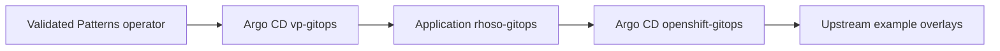

# RHOSO GitOps

[](https://opensource.org/licenses/Apache-2.0)

Validated Pattern for deploying [Red Hat OpenStack Services on OpenShift](https://docs.redhat.com/en/documentation/red_hat_openstack_services_on_openshift/)
(RHOSO) on a single OpenShift cluster using GitOps.

## Overview

This pattern uses the [Validated Patterns](https://validatedpatterns.io/) framework
to install the **rhoso-gitops** Helm meta-chart. That chart creates Argo CD
`Application` resources that sync RHOSO stages from the upstream
[openstack-k8s-operators/gitops](https://github.com/openstack-k8s-operators/gitops)
repository (`example/*` Kustomize overlays).



### Dual Argo CD namespaces

- The pattern operator deploys the parent **rhoso-gitops** Application into
  **`vp-gitops`** (Validated Patterns GitOps).
- Child RHOSO Applications are created in **`openshift-gitops`** (OpenShift
  GitOps operator), per the meta-chart defaults.

## Prerequisites

- OpenShift 4.14+ cluster with sufficient compute and storage for RHOSO
  (see `pattern-metadata.yaml` for sizing guidance).
- Cluster admin access and a working `kubeconfig`.
- [podman](https://podman.io/) 4.3+ for `./pattern.sh`.
- OpenShift GitOps operator available on the cluster (installed by the pattern
  framework or pre-installed).

## Install

1. Copy secrets template if you use Vault integration later:

   ```bash
   cp values-secret.yaml.template values-secret.yaml
   ```

2. Install the pattern:

   ```bash
   ./pattern.sh make install
   ```

   Or validate without applying:

   ```bash
   ./pattern.sh make validate-prereq
   ./pattern.sh make show
   ```

3. Watch Argo CD applications:

   ```bash
   oc get applications -n vp-gitops
   oc get applications -n openshift-gitops
   ```

## Configuration

| File | Purpose |
| --- | --- |
| `values-global.yaml` | Pattern name, sync policy, clustergroup chart version |
| `values-standalone.yaml` | Single-cluster catalog: namespaces, `rhoso-gitops` application |
| `overrides/values-rhoso-gitops.yaml` | Pins upstream Git repository, tag, and paths for child Applications |
| `overrides/values-AWS.yaml` | Optional platform overrides (placeholder) |

To change the upstream Git revision, edit `targetRevision` in
`overrides/values-rhoso-gitops.yaml`.

## Chart layout

- `charts/all/rhoso-gitops/` -- pattern meta-chart (see
  [charts/all/rhoso-gitops/README.md](charts/all/rhoso-gitops/README.md) for values
  and overrides)
- Upstream chart reference (standalone Helm install):
  [openstack-k8s-operators/gitops — charts/rhoso-apps](https://github.com/openstack-k8s-operators/gitops/tree/main/charts/rhoso-apps)
- `charts/region/` -- reserved for future region-specific charts

## Validation

```bash
./pattern.sh make validate-prereq
./pattern.sh make validate-schema
./pattern.sh make argo-healthcheck   # after install
```

Chart unit tests and lint run in GitHub Actions on changes under `charts/`.

## See also

- [Validated Patterns documentation](https://validatedpatterns.io/)
- [Upstream rhoso-apps chart](https://github.com/openstack-k8s-operators/gitops/tree/main/charts/rhoso-apps)
