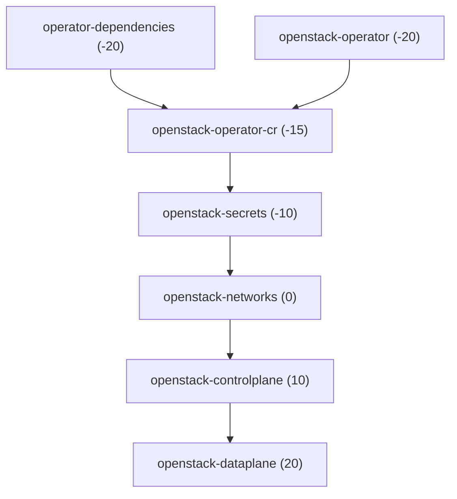

# rhoso-gitops meta-chart

This chart renders Argo CD `Application` resources to deploy [Red Hat OpenStack
Services on OpenShift](https://docs.redhat.com/en/documentation/red_hat_openstack_services_on_openshift/)
(RHOSO) from Git. It does not deploy RHOSO workloads directly; Kustomize
overlays in the upstream gitops repository remain the source of truth.

In this repository the chart is installed by the [Validated Patterns](https://validatedpatterns.io/)
framework as part of the **rhoso-gitops** pattern—not via `helm install` on a
bastion. Install the pattern with `./pattern.sh make install` as described in the
[Validated Patterns quick start](https://validatedpatterns.io/learn/quickstart/)
and the
[RHOSO GitOps pattern readme](../../../README.md#install).

For standalone Helm usage, values reference, and advanced examples using
`helm install` / `helm template`, see the upstream chart:

[openstack-k8s-operators/gitops — charts/rhoso-apps](https://github.com/openstack-k8s-operators/gitops/tree/main/charts/rhoso-apps)

## How this pattern uses the chart

The clustergroup application in `values-standalone.yaml` points Argo CD at
`charts/all/rhoso-gitops` and layers pattern overrides from
`overrides/values-rhoso-gitops.yaml` via `extraValueFiles`.

| Layer | File | Role |
| --- | --- | --- |
| Pattern global | `values-global.yaml` | Pattern name, sync policy, clustergroup chart version |
| Cluster group | `values-standalone.yaml` | Registers the `rhoso-gitops` application |
| Chart defaults | `charts/all/rhoso-gitops/values.yaml` | Default `applications` map and chart-wide keys |
| Pattern overrides | `overrides/values-rhoso-gitops.yaml` | Pins upstream `repoURL`, `targetRevision`, paths |

The Validated Patterns operator creates the parent **rhoso-gitops** Application in
**`vp-gitops`**. This chart creates child Applications in **`openshift-gitops`**
(see `applicationNamespace`).

To change upstream Git content (revision, paths, enable/disable apps), edit
`overrides/values-rhoso-gitops.yaml` and sync the pattern (or let automated sync
reconcile, per `global.options.syncPolicy` in `values-global.yaml`).

### Example: pin a different upstream revision

In `overrides/values-rhoso-gitops.yaml`:

```yaml
applications:
  openstack-operator:
    targetRevision: "v0.2.0"
  openstack-controlplane:
    targetRevision: "v0.2.0"
```

Apply the same key under every application you want on that revision, or only
the entries you need to change; unspecified keys keep chart defaults.

### Example: disable one stage

```yaml
applications:
  openstack-dataplane:
    enabled: false
```

### Example: repoint one application to your Git overlay

```yaml
applications:
  openstack-controlplane:
    repoURL: "https://github.com/example/your-gitops.git"
    path: "environments/prod/controlplane"
    targetRevision: "main"
```

### Example: Kustomize options on an application source

```yaml
applications:
  operator-dependencies:
    kustomize:
      components:
        - "https://github.com/openstack-k8s-operators/gitops/components/secrets/vault-secrets-operator?ref=v0.2.0"
```

Component URLs for Vault Secrets Operator and External Secrets Operator are
documented in the
[upstream components/secrets readme](https://github.com/openstack-k8s-operators/gitops/tree/main/components/secrets).

## Chart-wide values

| Key                      | Type   | Description                                                              |
| ------------------------ | ------ | ------------------------------------------------------------------------ |
| `applicationNamespace`   | string | Namespace for rendered `Application` CRs (default `openshift-gitops`).   |
| `destinationServer`      | string | `spec.destination.server` (default in-cluster API server).               |

This chart does not set `spec.destination.namespace`; child apps inherit
destination namespace from their Git manifests.

## Per-application keys

Each `applications.<name>` entry is a DNS-1123 label. Set `enabled: true` to
render that `Application`; `enabled: false` skips it.

| Key | Type | Description |
| --- | --- | --- |
| `enabled` | bool | Render this `Application` or skip. |
| `repoURL` | string | `spec.source.repoURL`. |
| `path` | string | Directory in the repository (empty → `"."`). |
| `targetRevision` | string | Branch, tag, or commit (empty → `"HEAD"`). |
| `syncWave` | string | `argocd.argoproj.io/sync-wave` annotation. |
| `syncOptions` | list | Used when `syncPolicy` is empty; default includes `Prune=true`. |
| `kustomize` | map | `spec.source.kustomize` ([Argo CD Kustomize][argo-kustomize]). |
| `finalizers` | list | `metadata.finalizers` (`background` or `foreground`). |
| `project` | string | Argo CD AppProject (default `default`). |
| `syncPolicy` | map | Full `spec.syncPolicy`; when set, top-level `syncOptions` are ignored. |

Schema validation: `values.schema.json` (used by `helm lint` in CI).

## Default applications

Enabled by default in chart `values.yaml` except `openstack-secrets`
(`enabled: false` until you configure a real Git path). Pattern overrides in
`overrides/values-rhoso-gitops.yaml` pin paths to the upstream
`example/*` directories at tag `v0.1.0`.

| Application | Purpose (summary) | Default `syncWave` |
| --- | --- | --- |
| `operator-dependencies` | Infra + optional VSO/ESO via `kustomize.components` | `-20` |
| `openstack-operator` | OpenStack operator | `-20` |
| `openstack-operator-cr` | Main `OpenStack` CR | `-15` |
| `openstack-secrets` | Secure-backend sync (disabled until configured) | `-10` |
| `openstack-networks` | Networks | `0` |
| `openstack-controlplane` | `OpenStackControlPlane` | `10` |
| `openstack-dataplane` | Data plane | `20` |

### Sync wave ordering



Sync waves apply when Argo CD deploys the parent **rhoso-gitops** Application (app-of-apps).
After changing overrides, confirm child apps in the Argo CD UI or with
`oc get applications -n openshift-gitops`.

## Secret zero (bootstrap credential)

RHOSO GitOps often uses a secure store (for example Vault). The bootstrap
credential must not live in Git. Typical steps:

1. Create the `openstack` namespace (or the namespace your docs specify).
2. Create the Kubernetes `Secret` out of band (`oc create secret generic ...`).
3. Add a Kustomize overlay in **your** Git repository for secret wiring (non-sensitive
   manifests only).
4. Enable and configure `applications.openstack-secrets` in
   `overrides/values-rhoso-gitops.yaml` (`enabled: true`, `repoURL`, `path`,
   `targetRevision`, optional `kustomize` patches).
5. Install the secrets operator via `operator-dependencies` using
   `kustomize.components` URLs from the
   [upstream secrets components](https://github.com/openstack-k8s-operators/gitops/tree/main/components/secrets).

See the upstream chart readme for full YAML examples and Helm-oriented wording.

## Maintenance

Chart changes are validated in CI (`helm lint`, `helm unittest`, kubeconform on
rendered manifests). When updating this chart from upstream, diff against
[charts/rhoso-apps](https://github.com/openstack-k8s-operators/gitops/tree/main/charts/rhoso-apps)
and re-run pattern validation:

```bash
./pattern.sh make validate-schema
```

## See also

- [RHOSO GitOps pattern readme](../../../README.md)
- [Validated Patterns quick start](https://validatedpatterns.io/learn/quickstart/)
- [Validated Patterns key concepts](https://validatedpatterns.io/learn/keyconcepts/)
- [Validated Patterns documentation](https://validatedpatterns.io/)
- [Upstream rhoso-apps chart](https://github.com/openstack-k8s-operators/gitops/tree/main/charts/rhoso-apps)
- [Argo CD Application specification][argo-app-spec]
- Templates: `templates/application.yaml`, `templates/_helpers.tpl`

[argo-app-spec]: https://argo-cd.readthedocs.io/en/stable/operator-manual/application-specification/
[argo-kustomize]: https://argo-cd.readthedocs.io/en/stable/user-guide/kustomize/
